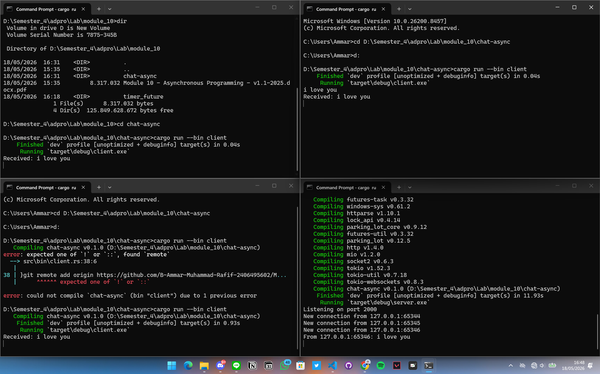

## Experiment 2.1: Original Broadcast Chat

# How to run
1. open 4 terminal consist of 1 for server and 3 for the client
2. type a message in any client, then press enter

# what happens

- the server listens on port 2000 via websocket
- each client connects and can send message
- when a client send a message, the server received it and broadcast it to all connected client
using tokio broadcast channel
- all clients can see every message typed by anyone

